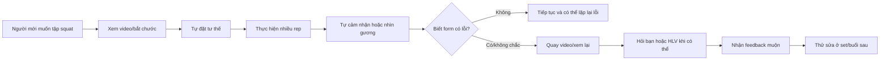
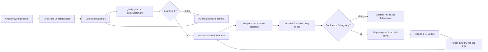

# Group Workflow — Before / After

## Current state

| Bước | Actor | Input | Output | Handoff / rủi ro |
|---:|---|---|---|---|
| 1 | Người mới | Nhu cầu tập | Video/hướng dẫn đã xem | Chất lượng nguồn khác nhau |
| 2 | Người mới | Hướng dẫn | Cách hiểu cá nhân | Không biết mình hiểu đúng chưa |
| 3 | Người mới | Chuyển động | Các rep squat | Không quan sát được toàn thân |
| 4 | Người mới | Cảm giác/gương | Tự đánh giá | Thiếu kinh nghiệm, góc nhìn hạn chế |
| 5 | Bạn/HLV | Video được gửi | Feedback | Không tức thời; không luôn sẵn có |
| 6 | Người mới | Feedback muộn | Cố gắng sửa | Có thể đã lặp lại lỗi nhiều rep |

**Bottleneck chính:** Không có feedback đáng tin cậy, có cấu trúc và đủ sớm để người mới sửa ở rep hoặc set tiếp theo.

---

## Future state — MVP AI Workflow

| Bước | Actor/component | Input | Output | Boundary / kiểm soát |
|---:|---|---|---|---|
| 1 | Người dùng | Mục tiêu tập | Chọn squat | Chỉ một exercise MVP |
| 2 | App | Camera preview | Setup hợp lệ/không hợp lệ | Không phân tích khi thiếu keypoint |
| 3 | Pose model | Video frames | Landmarks + confidence | Không suy diễn khi visibility thấp |
| 4 | Rep detector | Landmark sequence | Rep/phase | Cần temporal smoothing |
| 5 | Rule/classifier | Rep features | Error label + score | Chỉ label HLV đã định nghĩa |
| 6 | Safety gate | Confidence/scope | Feedback hoặc abstain | Ưu tiên không kết luận hơn kết luận sai |
| 7 | App | Error label | Cue ngắn | Cue cố định, không chẩn đoán |
| 8 | Người dùng | Cue | Rep tiếp theo | Dừng tập nếu đau/khó chịu bất thường |

## Boundary và fallback

- Chỉ dùng cho người trưởng thành khỏe mạnh thực hiện bodyweight squat.
- Không dùng cho người đang đau, chấn thương, phục hồi chức năng hoặc có chỉ định y tế đặc biệt.
- Không tự chọn mức tạ, số set, volume hoặc kế hoạch tập.
- Không hứa ngăn ngừa chấn thương.
- Không lưu video mặc định; nếu cần lưu cho pilot phải có consent, mục đích và thời hạn xóa rõ.
- Nếu pose/confidence không đạt, app từ chối đánh giá và chuyển sang hướng dẫn quay lại/checklist/HLV.
